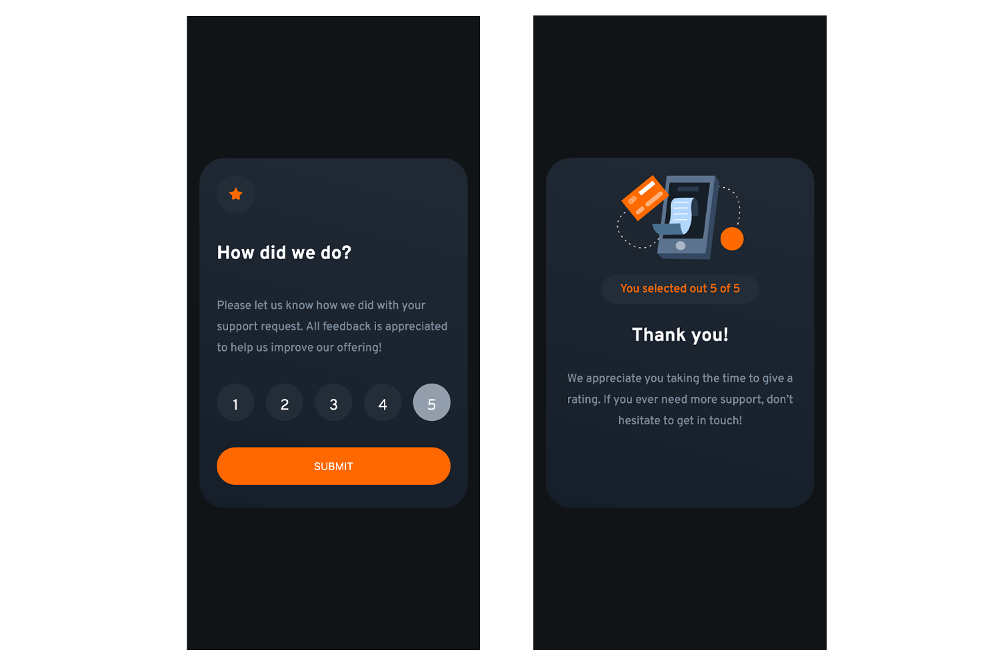

### Links

- Solution URL: [https://github.com/Smgy94/frontend-mentor-interactive-rating-component]
- Live Site URL: [https://smgy94.github.io/frontend-mentor-interactive-rating-component/]

# Frontend Mentor - Interactive rating component solution

This is a solution to the [Interactive rating component challenge on Frontend Mentor](https://www.frontendmentor.io/challenges/interactive-rating-component-koxpeBUmI). Frontend Mentor challenges help you improve your coding skills by building realistic projects.

## Table of contents

- [Links](#links)
- [The challenge](#the-challenge)
- [Screenshots](#screenshots)
- [Built with](#built-with)
- [Author](#author)

### The challenge

Users should be able to:

- View the optimal layout for the app depending on their device's screen size
- See hover states for all interactive elements on the page
- Select and submit a number rating
- See the "Thank you" card state after submitting a rating

### Screenshots

##Desktop Screenshot - How Did We Do ?

##Desktop Screenshot - Thank You ?

##Mobile Layout

### Built with

- Semantic HTML5 markup
- CSS custom properties
- Flexbox
- CSS Grid
- Mobile-first workflow
- Javascript

## Author

- Frontend Mentor - [@Smgy94](https://www.frontendmentor.io/profile/Smgy94)
- Twitter - [@ShaneMcGeown94](https://twitter.com/ShaneMcGeown94)
